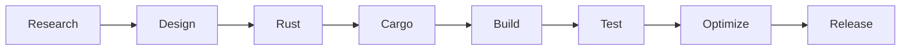

<div align="center">

<br>


<br>

# 🦀 m4n14ck

### `Systems Programmer` • `Rust Engineer` • `Security Research`

<br>

[](https://git.io/typing-svg)

</div>


━━━━━━━━━━━━━━━━━━━━━━━━━━━━━━━━━━━━━━━━


## ┌─[ SYSTEM PROFILE ]

```bash
┌──(m4n14ck@rustbox)-[~]
└─$ whoami


USER        : m4n14ck
ROLE        : Systems Programmer

PRIMARY     : Rust 🦀

PLATFORMS   :
 ├── Linux
 └── Windows


SPECIALITY  :

 ├── Low Level Programming
 ├── Memory Safety
 ├── Networking
 ├── CLI/TUI Development
 ├── Reverse Engineering
 ├── Performance Optimization
 └── Open Source
```


━━━━━━━━━━━━━━━━━━━━━━━━━━━━━━━━━━━━━━━━


# ⚙️ SYSTEM PHILOSOPHY

```text
> Safe by design.
> Fast by default.
> Fearless by choice.


Writing software close to the machine
without sacrificing reliability.
```


━━━━━━━━━━━━━━━━━━━━━━━━━━━━━━━━━━━━━━━━


# 🖥 CURRENT OPERATIONS


```text
╔══════════════════════════════════╗
║        ACTIVE DEVELOPMENT        ║
╚══════════════════════════════════╝


[✓] Rust Ecosystem

[✓] Systems Programming

[✓] Network Engineering

[✓] Linux Internals

[✓] Windows API

[✓] CLI Applications

[✓] Performance Engineering


SYSTEM STATUS:

████████████████░░░░ 80%
```


━━━━━━━━━━━━━━━━━━━━━━━━━━━━━━━━━━━━━━━━


# 🧰 TECH STACK


<div align="center">


</div>


━━━━━━━━━━━━━━━━━━━━━━━━━━━━━━━━━━━━━━━━


# 🦀 RUST ENVIRONMENT


<div align="center">


</div>


━━━━━━━━━━━━━━━━━━━━━━━━━━━━━━━━━━━━━━━━


# 🔐 SECURITY INTERESTS


```text
┌─────────────────────────────┐
│ SECURITY MODULE             │
└─────────────────────────────┘


[+] Reverse Engineering

[+] Binary Analysis

[+] Network Security

[+] Secure Software

[+] Windows Internals

[+] Linux Internals

[+] Defensive Programming
```


━━━━━━━━━━━━━━━━━━━━━━━━━━━━━━━━━━━━━━━━


# 🚀 PROJECTS


```text
/projects


├── rust-tools
│   └── Systems utilities

├── network-labs
│   └── Networking research

├── cli-frameworks
│   └── Terminal applications

├── security-labs
│   └── Security research

└── open-source
    └── Community projects
```


━━━━━━━━━━━━━━━━━━━━━━━━━━━━━━━━━━━━━━━━


# 🔄 DEVELOPMENT PIPELINE





━━━━━━━━━━━━━━━━━━━━━━━━━━━━━━━━━━━━━━━━


# 📊 GITHUB ACTIVITY


<div align="center">


</div>


━━━━━━━━━━━━━━━━━━━━━━━━━━━━━━━━━━━━━━━━


<div align="center">

```
cargo build --release

STATUS: SUCCESS

```

### "Safe by design. Fast by default."

🦀

</div>
