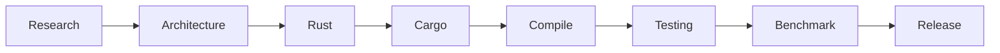

<div align="center">

<br>


<br>

```
╔══════════════════════════════════════╗
║          SYSTEM INITIALIZED          ║
╠══════════════════════════════════════╣
║ USER     : m4n14ck                   ║
║ CORE     : Rust                      ║
║ DOMAIN   : Systems Engineering       ║
║ STATUS   : ONLINE                    ║
╚══════════════════════════════════════╝
```

<br>

# 🦀 m4n14ck

### `Systems Engineer` • `Rust Developer` • `Security Research`

<br>

[](https://git.io/typing-svg)

</div>


━━━━━━━━━━━━━━━━━━━━━━━━━━━━━━━━━━━━━━━━


# `01 // IDENTITY`

```bash
┌──(m4n14ck@rustbox)-[~]
└─$ system_info


NAME        : m4n14ck

ROLE        : Systems Engineer

PRIMARY     : Rust 🦀


ENVIRONMENT :

 ├── Linux
 ├── Windows
 └── Embedded Systems


CORE SKILLS :

 ├── Low Level Programming
 ├── Memory Safety
 ├── Networking
 ├── CLI/TUI Engineering
 ├── Reverse Engineering
 ├── Performance Optimization
 └── Open Source
```


━━━━━━━━━━━━━━━━━━━━━━━━━━━━━━━━━━━━━━━━


# `02 // DESIGN PHILOSOPHY`

```text
╭────────────────────────────╮
│                            │
│  SAFE BY DESIGN            │
│  FAST BY DEFAULT           │
│  FEARLESS BY CHOICE        │
│                            │
╰────────────────────────────╯


Building reliable software
closer to the hardware.
```


━━━━━━━━━━━━━━━━━━━━━━━━━━━━━━━━━━━━━━━━


# `03 // ACTIVE OPERATIONS`

```text
╔══════════════════════════════════╗
║        DEVELOPMENT CORE          ║
╚══════════════════════════════════╝


[ONLINE] Rust Ecosystem

[ONLINE] Systems Programming

[ONLINE] Network Engineering

[ONLINE] Linux Internals

[ONLINE] Windows API

[ONLINE] CLI Applications

[ONLINE] Performance Engineering


SYSTEM LOAD:

████████████████░░░░ 80%
```


━━━━━━━━━━━━━━━━━━━━━━━━━━━━━━━━━━━━━━━━


# `04 // TECHNOLOGY MATRIX`

<div align="center">


</div>


━━━━━━━━━━━━━━━━━━━━━━━━━━━━━━━━━━━━━━━━


# `05 // RUST CORE`

<div align="center">


</div>


━━━━━━━━━━━━━━━━━━━━━━━━━━━━━━━━━━━━━━━━


# `06 // SECURITY MODULE`

```text
╔══════════════════════════════╗
║       SECURITY RESEARCH      ║
╚══════════════════════════════╝


[+] Reverse Engineering

[+] Binary Analysis

[+] Network Security

[+] Secure Software Design

[+] Windows Internals

[+] Linux Internals

[+] Defensive Engineering
```


━━━━━━━━━━━━━━━━━━━━━━━━━━━━━━━━━━━━━━━━


# `07 // PROJECT ARCHITECTURE`

```text
~/projects


├── rust-tools
│   └── System utilities


├── network-engine
│   └── Protocol experiments


├── cli-framework
│   └── Terminal applications


├── security-labs
│   └── Research environment


└── open-source
    └── Public contributions
```


━━━━━━━━━━━━━━━━━━━━━━━━━━━━━━━━━━━━━━━━


# `08 // BUILD PIPELINE`




━━━━━━━━━━━━━━━━━━━━━━━━━━━━━━━━━━━━━━━━


# `09 // SYSTEM METRICS`

<div align="center">


</div>


━━━━━━━━━━━━━━━━━━━━━━━━━━━━━━━━━━━━━━━━


<div align="center">

```text
cargo build --release


BUILD STATUS:

████████████████████ SUCCESS


SYSTEM READY 🦀
```

### `Safe by design. Fast by default.`

</div>
