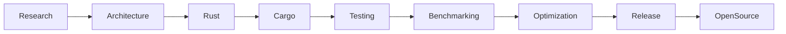

<div align="center">


<br>


# 🦀 m4n14ck

### Systems Programmer • Rust Engineer • Security Research

<br>

[](https://git.io/typing-svg)

</div>


---

# `$ whoami`

```bash
┌──(m4n14ck@rustbox)-[~]
└─$ whoami


Developer   : m4n14ck
Role        : Systems Programmer

Primary     : Rust

Platforms   :
 ├── Linux
 └── Windows


Focus Areas :

 ├── Memory Safety
 ├── Systems Programming
 ├── Networking
 ├── CLI/TUI Applications
 ├── Reverse Engineering
 ├── Performance Engineering
 └── Open Source
```

---

# Philosophy

```
> Safe by design.
> Fast by default.
> Fearless by choice.


Building reliable software
close to the metal.
```

---

# Current Operations

```text
╔══════════════════════════════════════╗
║          SYSTEM OPERATIONS            ║
╚══════════════════════════════════════╝


[✓] Rust Ecosystem

[✓] Systems Programming

[✓] Network Engineering

[✓] Linux Internals

[✓] Windows API

[✓] CLI Development

[✓] Performance Optimization

[✓] Open Source


Progress:

████████████████░░░░ 80%
```

---

# Tech Stack

<div align="center">


</div>


---

# Rust Ecosystem

<div align="center">


</div>


---

# Areas Of Interest

```text
╔══════════════════════════════════════╗
║        SYSTEMS ENGINEERING           ║
╚══════════════════════════════════════╝


■■■■■■■■■■■■■■■■■■■■

Memory Management

Concurrency

Networking

Operating Systems

Reverse Engineering

Windows Internals

Compiler Technology

CLI/TUI Development

Performance Optimization

Open Source
```

---

# Development Workflow



---

# Projects

<div align="center">


| Project | Description |
|---|---|
| 🦀 Rust Projects | Systems programming experiments |
| ⚡ Nmap Academy | Interactive network learning platform |
| 🔧 CLI Tools | Terminal based utilities |
| 🌐 Networking | Protocol and scanning research |
| 🖥 Low Level | OS and performance experiments |


</div>


---

# Security Interests

```text
SECURITY RESEARCH


[+] Network Security

[+] Reverse Engineering

[+] Binary Analysis

[+] Windows Internals

[+] Linux Internals

[+] Defensive Programming

[+] Secure Software Design
```

---

# GitHub Activity

<div align="center">


</div>


---

# Contact

<div align="center">


</div>


---

<div align="center">


### "Safe by design. Fast by default."


🦀


</div>
